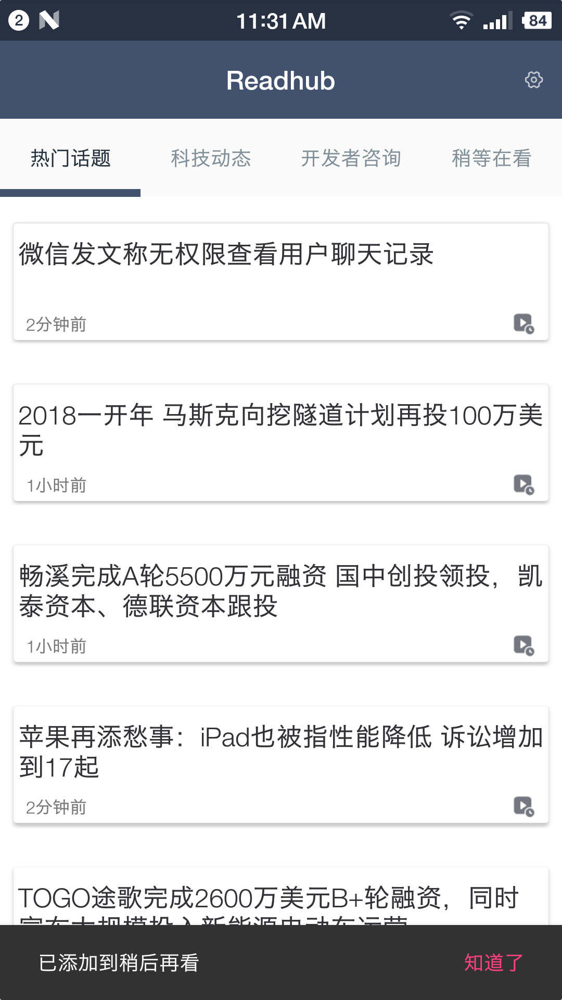
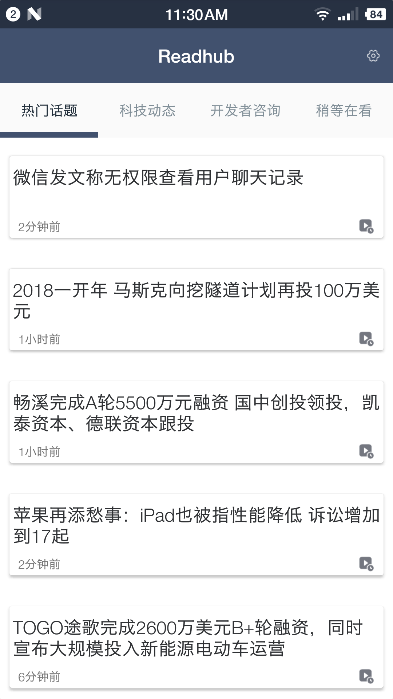

# Readhub-Android

## Readhub 简介

- 应用介绍

	**该应用这样为用户提供沉浸式阅读体验，极速体验等功能**

- Readhub 介绍：
 
	Readhub 是无码科技团队的一个副产品。这个产品有什么用？每天花几分钟了解一下互联网行业里发生的事情。行业里，每天值得关注的事情，可能并不超过 5 件，其他的信息都是可读可不读的。无码科技团队想通过技术和产品的手段，把每天获取资讯这个事情做得优雅一点。

## 下载体验

### 下载地址

- 扫码下载

### 内容

## 技术
1. MVP
2. Retrofit
3. Rxjava
3. RxAndroid
4. Room
5. Glide
6. Logger
7. 懒加载
8. 缓存

### 需要增加内容
	
###  1.1版本增加内容
 - 分享
 - 无限滑动浏览数据

## 版本

### 1.0版本

- 2018-01-01：数据缓存

- 2017-12-31：热门护体 科技动态 开发者咨询 稍等再看 等模块开发

- 2017-12-30：基本框架搭建
